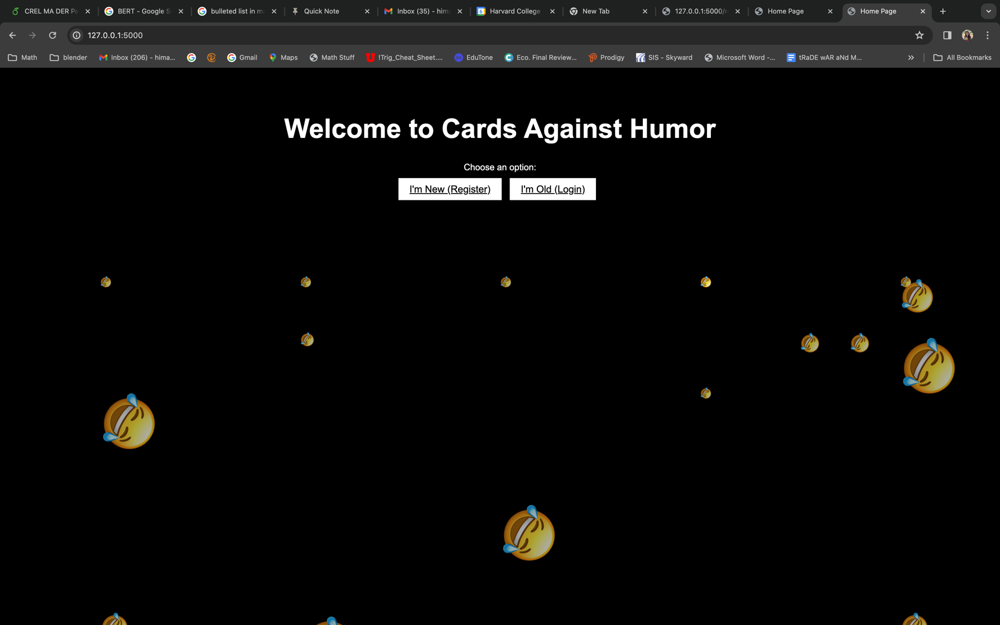
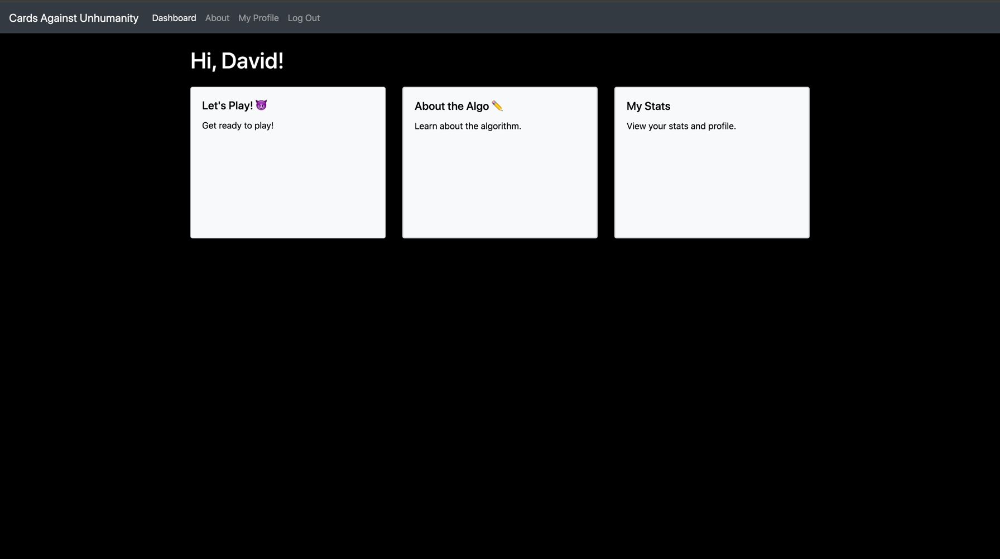
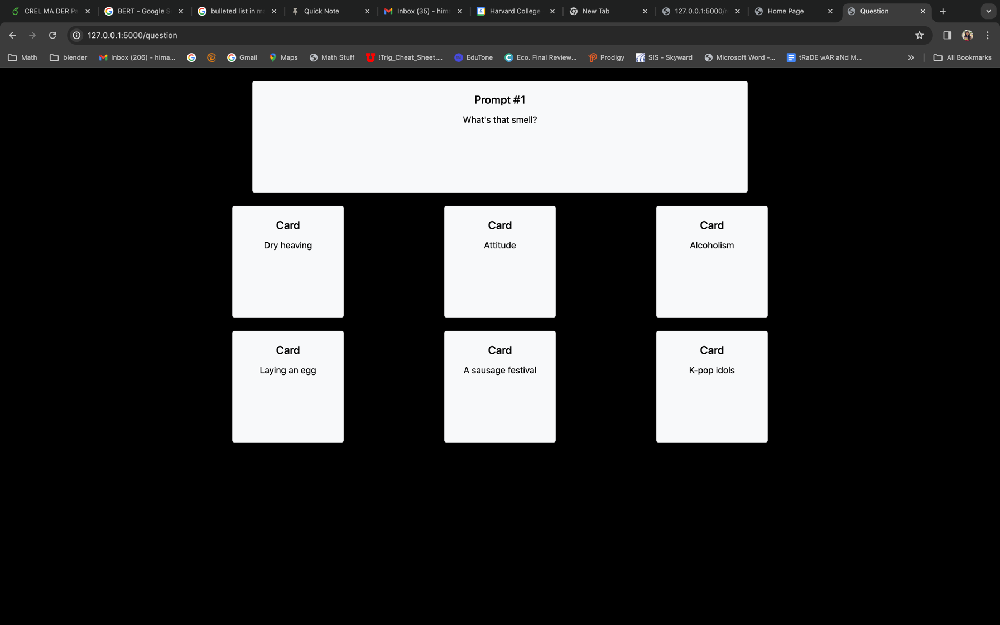
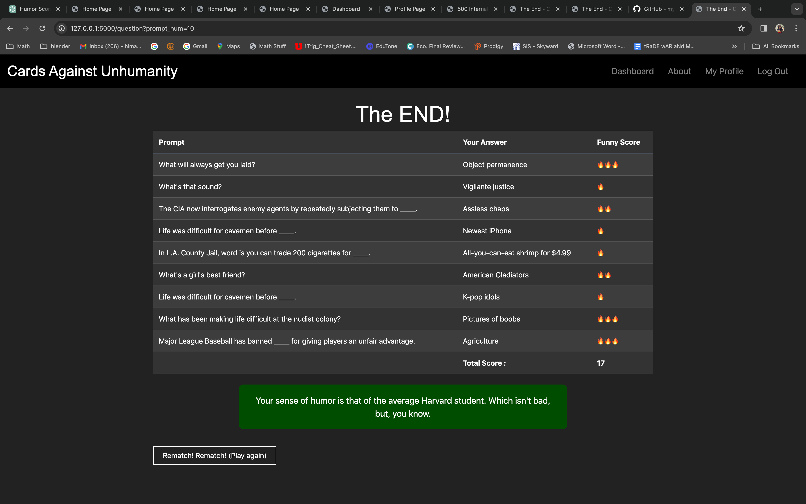
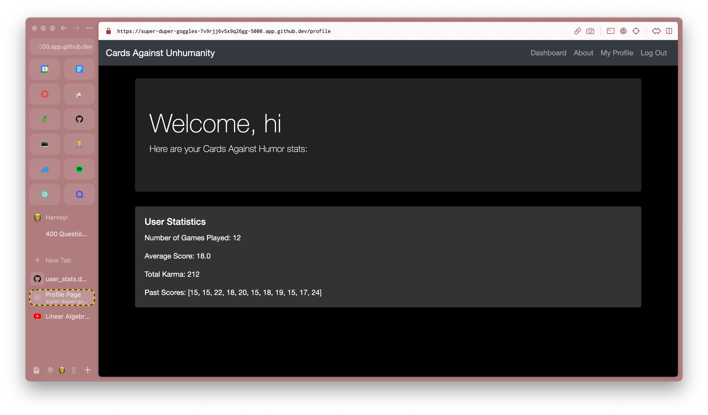

## Design for Cards-Against-Humor

Cards-Against-Humor is a **Flask-driven, Python-Based** web application that utilizes Python, HTML, CSS, SQL, and Javascript to run. 
We wanted to extend the skills we learned through CS50 and the Finance programming assignment to make our own fun app, that we think college students
would enjoy. 

The directory structure of this project follows that of the Flask/Python web app microframework, and contains several folders, including
* **README.MD** which gives instructions for how to deploy the application. 
* **DESIGN.MD** which gives an overview of the application's design (This is that.)
* **app.py** - which has the standard functionality of an app.py document in the Flask microframework, as well as some of the other key functionality for 
the Cards-Against-Humanity game, authentication, and user-statistics calculation
* **Templates** - a folder which contains the CSS files as well as the several HTML templates that are utilized in this web application
* **cards_manager.py** - contains ClassManager class that can be used to get cards (generalizable in case the web application needs to evolve);
for now, we are working with a fixed list of cards. 
* **prompts_manager.py** - analagous to cards_manager except for prompts. Contains functionality that can be generalized in case new prompts need to be generated;
for now we have inputted a fixed list of prompts, some taken from a CardsAgainstHumanity database, some that we came up with on our own
* **database.py** - can be run to set up a new database of users with a users table
* **user_stats_database.py** - can be run to set up a new database of user_statistics 
* **new_user_database.db** - SQL database of registered users for the web application
* **user_stats_db** - SQL database of users' game play
* **humor_algo.py** - contains functions to calculate "humor-score" for certain plays. More information about the algorithm
used can be found below in the About Our Algorithm section. 

## The Humor Algorithm
For this project, we have come up with what we feel is a useful but preliminary algorithm for measuring the humor score of certain
plays in Cards-Against-Humanity. Unfortunately, there are not a ton of robust models to measure humor from language. Thus, we utilized an emotion classification algorithm, and 
adapted the results to correlate better with what we consider to be funny! Functions associated with this algorithm have all been abstracted away into humor_algo.py, which is outside of the main
app.py document.

We imported a multi-label emotion classification BERT algorithm from HuggingFace Transformers database. 
This algorithm was trained on a large database of Reddit comments and their associated emotions. There are 28 emotions, and for each emotion,
the BERT gives a score. Of the 28 emotions, my partner and I determined ten "emotions of interest", which we consider as useful or 
correlated with comedic plays in Cards-Against-Humanity. These emotions of interest are: 

["surprised", "guilty", "joyful", "nostalgic", "embarrassed", "furious", "jealous", "content", "angry", "anticipating"]

The humor score is calculted based on **the number of "emotions of interest" in the top 5 emotions (of highest score) 
that the Transformer has determined from a string of {prompt} + {answer}**.

For example, if the prompt was "It's always spooky when", and your answer was "the next PSET drops", the transformer would assess
the associatedness of the string "It's always spooky when the next PSET drops"
" to each of  the 28 emotions. Depending on the 6 most likely emotional contexts for this string are then checked against the emotions of interest
to evaluate how many emotions are in the intersection of the two sets. The number of emotions in the intersection
of the two sets is the humor score. 

 _We recognize that this model is preliminary and may not be the ideal method of calculating a humor score from
 the game. Therefore, a future direction for this application would be to train a specialized NLP model
to recognize silliness in Cards-Against-Humanity plays. That is beyond the scope of the project we have developed for this class, although a topic of future interest for me
and my partner. Nonetheless, because humor is subjective, we feel that this model of classifying humor is valid as well_.

The transformer that we used can be found at the following link: 

https://huggingface.co/bdotloh/distilbert-base-uncased-go-emotion-empathetic-dialogues-context-v2

## app.py
Our web application is Python-based and uses the Flask microframework. Like The Finance PSET, our application stores most of its
primary functionality in a python file called app.py. I will go through the functions in app.py as well as their importance to 
our application. 
- index - returns index.html, which is the home page
- cards - returns cards.html, which is the main playing screen for the database
- hash_password - imports hashing algorithm to hash password
- register - adds user to new_user_database
- login - authenticates user to new_user_database
- logout - logs user out and brings them back to the login page
- get_cards - shows cards. We decided to implement this as a function 
in case we want ot adapt it later. 
- get_prompts - returns list of prompts. We decided to implement this as a function 
in case we want ot adapt it later. 
- display_question - important game play function. Displays ten prompts and their associated cards. At the end of the list of 10 prompts, updates user statistics by calling function end_game, and displaying game_data.
- collect_answers - collects answers from game play and adds them to session game data
- end_game - performs humor algorithm on user’s selected answers to calculate final humor score and display end game stats.
- update_user_stats - updates user stats in the user_stats table of user_stats.db
- profile - displays profile page with game play history 

## Important Databases

There are two important databases for this app - user_stats.db and new_user_database.db

user_stats.db contains a table called "user_stats" which has the game play history of the player, including the following columns:
- user_id INTEGER
- username TEXT
- games_played INTEGER - number of games played
- average_score REAL - average score of games played
- past_scores TEXT - string list of past_scores. I parse through this list in javascript to calculate total karma, which is the
total score over time, inspired by Sidechat!

The other important database is just a boring database of users, designed similarly to finance.
It is called new_user_database, and the table of users is called users. 
- user_id INTEGER that incremenets
- username TEXT 
- hashed_password TEXT - hashed version of the password 

## Key HTML Templates
Since our game is inpsired by Cards Against Humanity, we applied black-and-white styling to much of the web application.

**Index.HTML**, or the homepage, contains a login and register button. It also utilizes bootstrap to include raining laughing emojis. 

**Dashboard.HTML** is the dashboard once you login to your profile. It contains a navigation bar 
to the other key parts of the web application, as well as three options to play, learn about the algorithm, or view your profile/stats. 

**Question.HTML** displays questions in a Cards-Against-Humanity style, with the large prompt at the top of the screen, and the 
six answer choices stacked thorughout the bottom of the screen. We used bootstrap and GPT help to align the cards properly.

**Game_Data.HTML** displays results from the end of the game, using the humor score algorithm to calculate inddividuals scores for
CAH plays, as well as a total score, aggregating the points lost. The number of fire emojis is the humor score (LOL). It also gives you a fun description based on your score. We used javascript
to encode these. 

**Profile_page.HTML** displays game_play history, including past scores, and total scores. It was exciting to complete this because 
it was in the "best!" goal for our project!!  In the future, i would love to learn more about dynamic plots and see if we could include 
a "trends in humor" line plot. 

